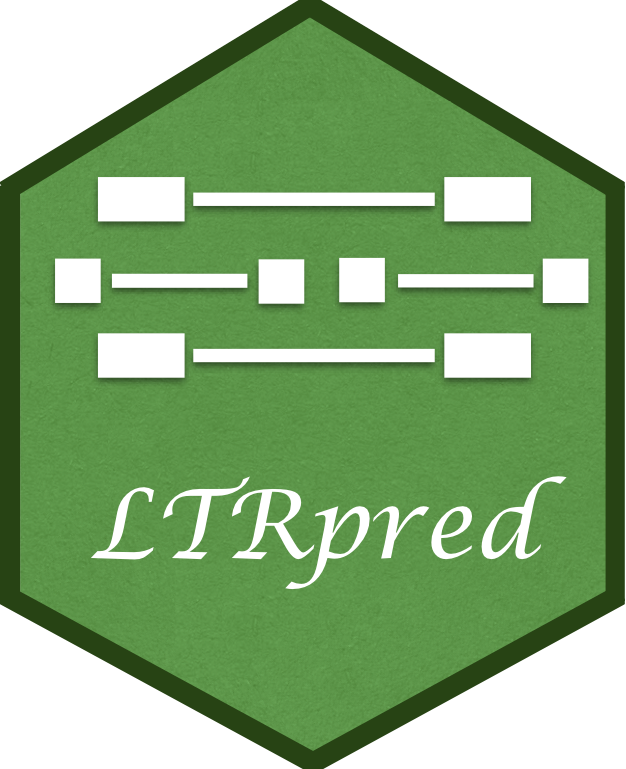
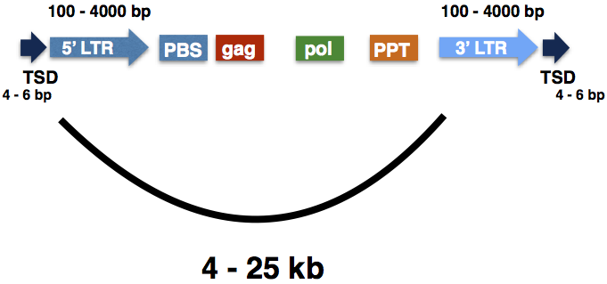

## __LTRpred(ict)__: _de novo_ annotation of intact retrotransposons 

[](https://joss.theoj.org/papers/eeb2359d2459d3ae448cafac3ae33211)

Transposable elements (TEs) comprise vast parts of eukaryotic genomes.
In the past, TEs were seen as selfish mobile elements capable of populating a host genome to increase their chances for survival. By doing so they leave traces of junk DNA in host genomes that are usually regarded as by-products when sequencing, assembling, and annotating new genomes.

However, this picture is slowly changing ([Drost & Sanchez, 2019](https://academic.oup.com/gbe/article/11/12/3382/5637757)) and TEs have been shown to be involved in generating a diverse range of novel phenotypes.

Today, the _de novo_ detection of transposable elements is performed by annotation tools which try to detect any type of repeated sequence, TE family, or remnand DNA loci that can be associated with a known transposable element within a genome assembly. The main goal of such efforts is to retrieve a maximum amount of loci that can be associated with TEs. If successful, such annotation can then be used to mask host genomes and to perform classic (phylo-)genomics studies focusing on host genes.

More than [300 repeat and TE annotation tools](https://docs.google.com/spreadsheets/d/1UBK70zExiL0gFVaIAILiGhflCGXAq_SF_lymaxTE1pY/edit#gid=0) have been developed so far. Most of them are designed and optimized to annotate either the entire repeat space or specific superfamilies of TEs and their DNA remnants.

>The LTRpred pipeline has a different goal than all other annotation tools. It focuses particularly on [LTR retrotransposons](https://www.ncbi.nlm.nih.gov/pmc/articles/PMC463057/) and aims to annotate only functional and potentially mobile elements. Such type of annotation is crucial for studying retrotransposon activity in eukaryotic genomes and to understand whether specific retrotransposon families can be activated artificially and harnessed to [mutagenize genomes at much faster speed](https://www.slcu.cam.ac.uk/news/tomato-jumping-genes).

In detail, `LTRpred` will take any genome assembly file in `fasta` format as input and will generate a detailed annotation of functional and potentially mobile LTR retrotransposons.




__Users can consult a comprehensive [Introduction](https://hajkd.github.io/LTRpred/articles/Introduction.html) to the `LTRpred` pipeline to get familiar with the tool.__

## Install

The fastest way to install `LTRpred` is via a [Docker container](https://hub.docker.com/r/drostlab/ltrpred).
Please make sure to read the [detailed installation instructions](https://hajkd.github.io/LTRpred/articles/Introduction.html#installation) to be able to
pass data to the container.

```bash
# retrieve docker image from dockerhub
docker pull drostlab/ltrpred
# run ltrpred container
docker run --rm -ti drostlab/ltrpred
# start R prompt within ltrpred container
~:/app# R
```

Users who wish to run the `LTRpred` Docker container in a [conda](https://docs.conda.io/en/latest/) environment 
can use the [following approach based on UDocker](https://github.com/HajkD/LTRpred/issues/16) (Many thanks to Ilja Bezrukov). 

## Citation
Please cite the following paper when using `LTRpred` for your own research:

> HG Drost. [__LTRpred: _de novo_ annotation of intact retrotransposons__](https://joss.theoj.org/papers/10.21105/joss.02170). __Journal of Open Source Software__, 5(50), 2170 (2020).

## Tutorials

### Quick Start

The fastest way to generate a LTR retrotransposon prediction for a genome of interest (after [installing](https://hajkd.github.io/LTRpred/articles/Introduction.html) all prerequisite command line tools) is to use the
`LTRpred()` function and relying on the default parameters. In the following example,
a LTR transposon prediction is performed for parts of the Human Y chromosome.

```r
# Perform de novo LTR transposon prediction for the Human Y chromosome
LTRpred::LTRpred(genome.file = system.file("Hsapiens_ChrY.fa", package = "LTRpred"))
```

When running your own genome, please specify `genome.file = "path/to/your/genome.fasta` instead of `system.file(..., package = "LTRpred")`. The command `system.file(..., package = "LTRpred")` merely references the path to the example file stored in the LTRpred package itself.


This tutorial introduces users to `LTRpred`:

- [Introduction to LTRpred](https://hajkd.github.io/LTRpred/articles/Introduction.html)

Users can also read the tutorials within ([RStudio](http://www.rstudio.com/)) :

```r
library(LTRpred)
browseVignettes("LTRpred")
```

You can also find a list of all available `LTRpred` functions here: https://hajkd.github.io/LTRpred/reference/index.html

### Studies that successfully used `LTRpred` to annotate functional retrotransposons

> - Z Wang & D Baulcombe. [__Transposon age and non-CG methylation__](https://www.nature.com/articles/s41467-020-14995-6). __Nature Communications__, 11, 1221 (2020).
> - J Cho, M Benoit, M Catoni, __HG Drost__, A Brestovitsky, M Oosterbeek and J Paszkowski.  [__Sensitive detection of pre-integration intermediates of LTR retrotransposons in crop plants__](https://www.nature.com/articles/s41477-018-0320-9). __Nature Plants__, 5,  26-33 (2019).
>
> - H Kundariya et al. [__MSH1-induced heritable enhanced growth vigor through grafting is associated with the RdDM pathway in plants__](https://www.nature.com/articles/s41467-020-19140-x) __Nature Communications__, _in press_ (2020).
>
> - M Benoit, __HG Drost__, M Catoni, Q Gouil, S Lopez-Gomollon, DC Baulcombe, J Paszkowski. [__Environmental and epigenetic regulation of Rider retrotransposons in tomato__](https://journals.plos.org/plosgenetics/article?id=10.1371/journal.pgen.1008370). __PloS Genetics__, 15(9): e1008370 (2019). 
>
> - Nguinkal _et al._ [__The First Highly Contiguous Genome Assembly of Pikeperch (Sander lucioperca), an Emerging Aquaculture Species in Europe__](https://www.mdpi.com/2073-4425/10/9/708/htm) __Genes__, 0(9), 708 (2019).
> - E Cerruti, C Gisbert, __HG Drost__, D Valentino, E Portis, L Barchi, J Prohens, S Lanteri, C Comino,  M Catoni. [__Epigenetic bases of grafting-induced vigour in eggplant__](https://www.biorxiv.org/content/10.1101/831719v1). __bioaRxiv__ (2019).
>
> - P Gan, R Hiroyama, A Tsushima, S Masuda _et al_.
[__Subtelomeric regions and a repeat-rich chromosome harbor multicopy effector gene clusters with variable conservation in multiple plant pathogenic Colletotrichum species__](https://www.biorxiv.org/content/10.1101/2020.04.28.061093v1.abstract) __bioRxiv__ (2020)
>
> - J Wang et al. [__Gigantic Genomes Can Provide Empirical Tests of TE Dynamics Models--An Example from Amphibians__](https://www.biorxiv.org/content/10.1101/2020.08.19.257527v1). __bioRxiv__, (2020).
>
> - Y Ayukawa et al. [__A pair of effectors encoded on a conditionally dispensable chromosome of Fusarium oxysporum suppress host-specific immunity__](https://www.biorxiv.org/content/10.1101/2020.10.06.329052v1). __bioRxiv__, (2020).


## Discussions and Bug Reports

I would be very happy to learn more about potential improvements of the concepts and functions
provided in this package.

Furthermore, in case you find some bugs or need additional (more flexible) functionality of parts
of this package, please let me know:

https://github.com/HajkD/LTRpred/issues

## Acknowledgement

I would like to thank the [Paszkowski team](http://www.slcu.cam.ac.uk/research/paszkowski-group/group-members) for incredible support and motivating discussions that led to 
the realization of this project.


